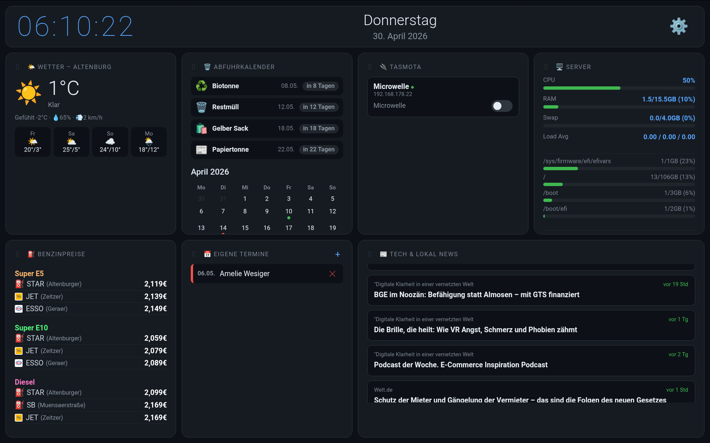

# Node.js Tasmota & Info Dashboard

Ein extrem leichtgewichtiges, lokales Dashboard für das Heimnetzwerk. 
Komplett geschrieben in Vanilla JavaScript und Node.js. 
Keine externen Frameworks, keine Datenbank.



## Features
* **Tasmota Steuerung:** Smart-Home Steckdosen und Lichter im lokalen Netz finden und schalten.
* **Server Status:** CPU, RAM und Temperatur-Anzeige des Hosts.
* **Abfallkalender:** Liest `.ics` Dateien aus und zeigt die nächste Abholung.
* **Termine:** Mini-Kalender für eigene Notizen.
* **Wetter:** 3-Tage Vorschau für deinen Ort (wttr.in).
* **Benzinpreise:** Tankstellen in der Nähe via Web-Scraper (ich-tanke.de).
* **News-Ticker:** RSS-Feeds in einem Laufband.
* **Layout:** Widgets können per Drag & Drop verschoben und ein/ausgeblendet werden.

## Setup & Installation

### 1. Voraussetzungen
* **Node.js** installiert 
  *(Unter Linux / Raspberry Pi schnell installiert via Terminal: `sudo apt update && sudo apt install nodejs npm -y`)*
* SSL-Zertifikate (für HTTPS Zugriff)

### 2. Projekt klonen & Abhängigkeiten installieren
```bash
git clone https://github.com/Daddelgreis74/Neo-Dashboard.git dashboard
cd dashboard
npm install
```

### 3. HTTPS Zertifikate generieren (Erforderlich!)
Das Dashboard läuft standardmäßig auf `https://...:8443`. Da Browser für bestimmte Funktionen HTTPS fordern, brauchst du ein lokales Zertifikat (kann selbstsigniert sein).

Führe diesen Befehl im `dashboard` Ordner aus:
```bash
openssl req -nodes -new -x509 -keyout key.pem -out cert.pem -days 3650
```

### 4. Konfiguration (Umgebungsvariablen)
Du kannst das Verhalten über Umgebungsvariablen anpassen (optional).
* `PORT` (Standard: 8443)

*Die Einstellungen für Abfallkalender, Wetter und Spritpreise werden bequem über die Einstellungen (Zahnrad) im Dashboard selbst verwaltet.*

**Beispiel Start mit abweichendem Port:**
```bash
PORT=9000 node server.js
```

### 5. Starten
```bash
node server.js
```
Anschließend ist das Dashboard im Browser unter `https://<IP-DEINES-SERVERS>:8443` erreichbar.
*(Da es ein selbstsigniertes Zertifikat ist, musst du im Browser beim ersten Mal auf "Erweitert -> Risiko akzeptieren" klicken).*

---
**Daten & Speicherung:** 
Alle Einstellungen (Layout, gefundene Tasmota-Geräte, News-Feeds) werden lokal in kleinen JSON-Dateien im gleichen Verzeichnis gespeichert (`layout.json`, `tasmota.json` etc.).